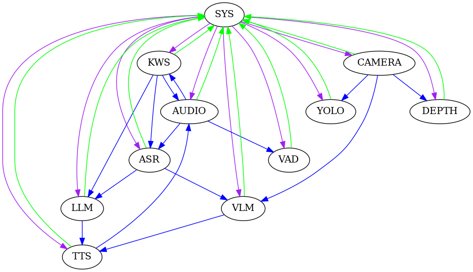

# StackFlow

<p align="center"></p>


<p align="center">
  StackFlow 是一个简单、疾速、优雅的面向嵌入式开发者一站式 AI 服务基础设施项目，目的是让 Maker 和 Haker 们能够快速的在当前的嵌入式设备中获取到强大的 AI 加速能力。StackFlow 能够为各类人机交互设备注入智慧的灵魂。
</p>


## Table of Contents

* [特性](#特性)
* [Demo](#demo)
* [模型列表](#模型列表)
* [环境要求](#环境要求)
* [编译](#编译)
* [安装](#安装)
* [在线安装](#在线安装)
* [升级](#升级)
* [运行](#运行)
* [配置](#配置)
* [接口](#接口)
* [贡献](#贡献)


## 特性
<!--  -->
* 分布式通信架构。每个单元都能够单独工作或者和其他单元配合工作。
* 多模型支持。包括但不限于语音识别、语音合成、图像识别、自然语言处理、LLM 大模型助手推理等。
* 数据内部流转。可根据需求配置不同单元协同工作，避免复杂的数据处理流程。
* 简单易用。通过标准 json 交换数据，快速实现 AI 服务。
* 离线化运行。无需联网即可实现本地 AI 服务。
* 多平台支持。包括但不限于 Module LLM、LLM630 Compute Kit 等。
* 灵活配置。所有单元均可完全配置运行参数，在相同的数据流处理情况下，随意更换模型和修改模型运行参数。
* 简单易用。开发者只需关注模型和硬件平台，无需关注底层通信和数据处理细节，即可快速实现 AI 服务。
* 高效稳定。通过 ZMQ 信道传输，数据传输效率高，延迟低，稳定性强。
* 开源免费。StackFlow 采用 MIT 许可证。
* 多语言支持。单元主体由 C++ 实现，性能极致优化，可扩展至多变成语言支持。（需要支持 ZMQ 编程）

StackFlow 还在不断优化和迭代，在框架更加完善的同时，会持续增加更多功能，敬请期待。

StackFlow 语音助手的主要工作模式：


开机后，KWS、ASR、LLM、TTS、AUDIO 被配置成协同工作状态。当 KWS 从 AUDIO 单元获取的音频中检测出关键词后，发出唤醒信号。此时，ASR 开始工作，识别 AUDIO 的音频数据，并将结果发布到自己的输出信道中。LLM 接收到 ASR 转换后的文本数据后，开始进行推理，并将结果发布到自己的输出信道中。TTS 接收到 LLM 的结果后，开始进行语音合成，合成完成后根据配置来播放合成好的音频数据。


## Demo
- [StackFlow 连续语音识别](./projects/llm_framework/README.md)
- [StackFlow LLM 大模型唤醒对话](./projects/llm_framework/README.md)
- [StackFlow TTS 语音合成播放](./projects/llm_framework/README.md)
- [StackFlow yolo 视觉检测](https://github.com/Abandon-ht/ModuleLLM_Development_Guide/tree/dev/ESP32/cpp)
- [StackFlow VLM 图片描述](https://github.com/Abandon-ht/ModuleLLM_Development_Guide/tree/dev/ESP32/cpp)

## 模型列表
| 模型名 | 模型类型 | 模型大小 | 模型能力 | 模型配置文件 | 计算单元 |
| :----: | :----: | :----: | :----: | :----: | :----: |
| [silero-vad](https://github.com/snakers4/silero-vad) | VAD | 3.3M | 语音活动检测 | [mode_silero-vad.json](projects/llm_framework/main_vad/mode_silero-vad.json) | CPU |
| [sherpa-onnx-kws-zipformer-gigaspeech-3.3M-2024-01-01](https://github.com/k2-fsa/sherpa-onnx/releases/download/kws-models/sherpa-onnx-kws-zipformer-gigaspeech-3.3M-2024-01-01.tar.bz2) | KWS | 6.4M | 关键词识别 | [mode_sherpa-onnx-kws-zipformer-gigaspeech-3.3M-2024-01-01.json](projects/llm_framework/main_kws/mode_sherpa-onnx-kws-zipformer-gigaspeech-3.3M-2024-01-01.json) | CPU |
| [sherpa-onnx-kws-zipformer-wenetspeech-3.3M-2024-01-01](https://github.com/k2-fsa/sherpa-onnx/releases/download/kws-models/sherpa-onnx-kws-zipformer-wenetspeech-3.3M-2024-01-01.tar.bz2) | KWS | 5.7M | 关键词识别 | [mode_sherpa-onnx-kws-zipformer-wenetspeech-3.3M-2024-01-01.json](projects/llm_framework/main_kws/mode_sherpa-onnx-kws-zipformer-wenetspeech-3.3M-2024-01-01.json) | CPU |
| [sherpa-ncnn-streaming-zipformer-20M-2023-02-17](https://huggingface.co/desh2608/icefall-asr-librispeech-pruned-transducer-stateless7-streaming-small) | ASR | 40M | 语音识别 | [mode_sherpa-ncnn-streaming-zipformer-20M-2023-02-17.json](projects/llm_framework/main_asr/mode_sherpa-ncnn-streaming-zipformer-20M-2023-02-17.json) | CPU |
| [sherpa-ncnn-streaming-zipformer-zh-14M-2023-02-23](https://github.com/k2-fsa/icefall/tree/master/egs/librispeech/ASR/pruned_transducer_stateless7_streaming) | ASR | 24M | 语音识别 | [mode_sherpa-ncnn-streaming-zipformer-zh-14M-2023-02-23.json](projects/llm_framework/main_asr/mode_sherpa-ncnn-streaming-zipformer-zh-14M-2023-02-23.json) | CPU |
| [whisper-tiny](https://huggingface.co/openai/whisper-tiny) | ASR | 201M | 语音识别 | [mode_whisper-tiny.json](projects/llm_framework/main_whisper/mode_whisper-tiny.json) | NPU |
| [whisper-base](https://huggingface.co/openai/whisper-base) | ASR | 309M | 语音识别 | [mode_whisper-base.json](projects/llm_framework/main_whisper/mode_whisper-base.json) | NPU |
| [whisper-small](https://huggingface.co/openai/whisper-small) | ASR | 725M | 语音识别 | [mode_whisper-small.json](projects/llm_framework/main_whisper/mode_whisper-small.json) | NPU |
| [single-speaker-fast](https://github.com/huakunyang/SummerTTS) | TTS | 77M | 语音生成 | [mode_whisper-tiny.json](projects/llm_framework/main_tts/mode_single-speaker-fast.json) | CPU |
| [single-speaker-english-fast](https://github.com/huakunyang/SummerTTS) | TTS | 60M | 语音生成 | [mode_whisper-tiny.json](projects/llm_framework/main_tts/mode_single-speaker-english-fast.json) | CPU |
| [melotts-en-au](https://huggingface.co/myshell-ai/MeloTTS-English) | TTS | 102M | 语音生成 | [mode_melotts-en-au.json](projects/llm_framework/main_melotts/mode_melotts-en-au.json) | NPU |
| [melotts-en-br](https://huggingface.co/myshell-ai/MeloTTS-English) | TTS | 102M | 语音生成 | [mode_melotts-en-au.json](projects/llm_framework/main_melotts/mode_melotts-en-br.json) | NPU |
| [melotts-en-default](https://huggingface.co/myshell-ai/MeloTTS-English) | TTS | 102M | 语音生成 | [mode_melotts-en-india.json](projects/llm_framework/main_melotts/mode_melotts-en-default.json) | NPU |
| [melotts-en-us](https://huggingface.co/myshell-ai/MeloTTS-English) | TTS | 102M | 语音生成 | [mode_melotts-en-au.json](projects/llm_framework/main_melotts/mode_melotts-en-us.json) | NPU |
| [melotts-es-es](https://huggingface.co/myshell-ai/MeloTTS-Spanish) | TTS | 83M | 语音生成 | [mode_melotts-es-es.json](projects/llm_framework/main_melotts/mode_melotts-es-es.json) | NPU |
| [melotts-ja-jp](https://huggingface.co/myshell-ai/MeloTTS-Japanese) | TTS | 83M | 语音生成 | [mode_melotts-ja-jp.json](projects/llm_framework/main_melotts/mode_melotts-ja-jp.json) | NPU |
| [melotts-zh-cn](https://huggingface.co/myshell-ai/MeloTTS-Chinese) | TTS | 86M | 语音生成 | [mode_melotts-zh-cn.json](projects/llm_framework/main_melotts/mode_melotts-zh-cn.json) | NPU |
| [deepseek-r1-1.5B-ax630c](https://huggingface.co/deepseek-ai/DeepSeek-R1-Distill-Qwen-1.5B) | LLM | 2.0G | 文本生成 | [mode_deepseek-r1-1.5B-ax630c.json](projects/llm_framework/main_llm/models/mode_deepseek-r1-1.5B-ax630c.json) | NPU |
| [deepseek-r1-1.5B-p256-ax630c](https://huggingface.co/deepseek-ai/DeepSeek-R1-Distill-Qwen-1.5B) | LLM | 2.0G | 文本生成 | [mode_deepseek-r1-1.5B-p256-ax630c.json](projects/llm_framework/main_llm/models/mode_deepseek-r1-1.5B-p256-ax630c.json) | NPU |
| [llama3.2-1B-p256-ax630c](https://huggingface.co/meta-llama/Llama-3.2-1B) | LLM | 1.7G | 文本生成 | [mode_llama3.2-1B-p256-ax630c.json](projects/llm_framework/main_llm/models/mode_llama3.2-1B-p256-ax630c.json) | NPU |
| [llama3.2-1B-prefill-ax630c](https://huggingface.co/meta-llama/Llama-3.2-1B) | LLM | 1.7G | 文本生成 | [mode_llama3.2-1B-prefill-ax630c.json](projects/llm_framework/main_llm/models/mode_llama3.2-1B-prefill-ax630c.json) | NPU |
| [openbuddy-llama3.2-1B-ax630c](https://huggingface.co/OpenBuddy/openbuddy-llama3.2-1b-v23.1-131k) | LLM | 1.7G | 文本生成 | [mode_openbuddy-llama3.2-1B-ax630c.json](projects/llm_framework/main_llm/models/mode_openbuddy-llama3.2-1B-ax630c.json) | NPU |
| [qwen2.5-0.5B-Int4-ax630c](https://huggingface.co/Qwen/Qwen2.5-0.5B-Instruct-GPTQ-Int4) | LLM | 626M | 文本生成 | [mode_qwen2.5-0.5B-Int4-ax630c.json](projects/llm_framework/main_llm/models/mode_qwen2.5-0.5B-Int4-ax630c.json) | NPU |
| [qwen2.5-0.5B-p256-ax630c](https://huggingface.co/Qwen/Qwen2.5-0.5B-Instruct) | LLM | 760M | 文本生成 | [mode_qwen2.5-0.5B-p256-ax630c.json](projects/llm_framework/main_llm/models/mode_qwen2.5-0.5B-p256-ax630c.json) | NPU |
| [qwen2.5-0.5B-prefill-20e](https://huggingface.co/Qwen/Qwen2.5-0.5B-Instruct) | LLM | 758M | 文本生成 | [mode_qwen2.5-0.5B-prefill-20e.json](projects/llm_framework/main_llm/models/mode_qwen2.5-0.5B-prefill-20e.json) | NPU |
| [qwen2.5-1.5B-Int4-ax630c](https://huggingface.co/Qwen/Qwen2.5-1.5B-Instruct-GPTQ-Int4) | LLM | 1.5G | 文本生成 | [mode_qwen2.5-1.5B-Int4-ax630c.json](projects/llm_framework/main_llm/models/mode_qwen2.5-1.5B-Int4-ax630c.json) | NPU |
| [qwen2.5-1.5B-p256-ax630c](https://huggingface.co/Qwen/Qwen2.5-1.5B-Instruct) | LLM | 2.0G | 文本生成 | [mode_qwen2.5-1.5B-p256-ax630c.json](projects/llm_framework/main_llm/models/mode_qwen2.5-1.5B-p256-ax630c.json) | NPU |
| [qwen2.5-1.5B-ax630c](https://huggingface.co/Qwen/Qwen2.5-1.5B-Instruct) | LLM | 2.0G | 文本生成 | [mode_qwen2.5-1.5B-ax630c.json](projects/llm_framework/main_llm/models/mode_qwen2.5-1.5B-ax630c.json) | NPU |
| [qwen2.5-coder-0.5B-ax630c](https://huggingface.co/Qwen/Qwen2.5-Coder-0.5B-Instruct) | LLM | 756M | 文本生成 | [mode_qwen2.5-coder-0.5B-ax630c.json](projects/llm_framework/main_llm/models/mode_qwen2.5-coder-0.5B-ax630c.json) | NPU |
| [qwen3-0.6B-ax630c](https://huggingface.co/AXERA-TECH/InternVL2_5-1B) | LLM | 917M | 文本生成 | [mode_qwen3-0.6B-ax630c.json](projects/llm_framework/main_llm/models/mode_qwen3-0.6B-ax630c.json) | NPU |
| [mode_internvl2.5-1B-364-ax630c](https://huggingface.co/Qwen/Qwen3-0.6B) | VLM | 1.2G | 多模态文本生成 | [mode_internvl2.5-1B-364-ax630c.json](projects/llm_framework/main_vlm/models/mode_internvl2.5-1B-364-ax630c.json) | NPU |
| [smolvlm-256M-ax630c](https://huggingface.co/HuggingFaceTB/SmolVLM-256M-Instruct) | VLM | 330M | 多模态文本生成 | [mode_smolvlm-256M-ax630c.json](projects/llm_framework/main_vlm/models/mode_smolvlm-256M-ax630c.json) | NPU |
| [smolvlm-500M-ax630c](https://huggingface.co/HuggingFaceTB/SmolVLM-500M-Instruct) | VLM | 605M | 多模态文本生成 | [mode_smolvlm-256M-ax630c.json](projects/llm_framework/main_vlm/models/mode_smolvlm-500M-ax630c.json) | NPU |
| [yolo11n](https://github.com/ultralytics/ultralytics) | CV | 2.8M | 目标检测 | [mode_yolo11n.json](projects/llm_framework/main_yolo/mode_yolo11n.json) | NPU |
| [yolo11n-npu1](https://github.com/ultralytics/ultralytics) | CV | 2.8M | 目标检测 | [mode_yolo11n-npu1.json](projects/llm_framework/main_yolo/mode_yolo11n-npu1.json) | NPU |
| [yolo11n-seg](https://github.com/ultralytics/ultralytics) | CV | 3.0M | 实例分割 | [mode_yolo11n-seg.json](projects/llm_framework/main_yolo/mode_yolo11n-seg.json) | NPU |
| [yolo11n-seg-npu1](https://github.com/ultralytics/ultralytics) | CV | 3.0M | 实例分割 | [mode_yolo11n-seg-npu1.json](projects/llm_framework/main_yolo/mode_yolo11n-seg-npu1.json) | NPU |
| [yolo11n-pose](https://github.com/ultralytics/ultralytics) | CV | 3.1M | 姿态检测 | [mode_yolo11n-pose.json](projects/llm_framework/main_yolo/mode_yolo11n-pose.json) | NPU |
| [yolo11n-pose-npu1](https://github.com/ultralytics/ultralytics) | CV | 3.1M | 姿态检测 | [mode_yolo11n-pose-npu1.json](projects/llm_framework/main_yolo/mode_yolo11n-pose-npu1.json) | NPU |
| [yolo11n-hand-pose](https://github.com/ultralytics/ultralytics) | CV | 3.2M | 姿态检测 | [mode_yolo11n-hand-pose.json](projects/llm_framework/main_yolo/mode_yolo11n-hand-pose.json) | NPU |
| [yolo11n-hand-pose-npu1](https://github.com/ultralytics/ultralytics) | CV | 3.2M | 姿态检测 | [mode_yolo11n-hand-pose-npu1.json](projects/llm_framework/main_yolo/mode_yolo11n-hand-pose-npu1.json) | NPU |
| [depth-anything-ax630c](https://github.com/DepthAnything/Depth-Anything-V2) | CV | 29M | 单目深度估计 | [mode_depth-anything-ax630c.json](projects/llm_framework/main_depth_anything/mode_depth-anything-ax630c.json) | NPU |
| [depth-anything-npu1-ax630c](https://github.com/DepthAnything/Depth-Anything-V2) | CV | 29M | 单目深度估计 | [mode_depth-anything-npu1-ax630c.json](projects/llm_framework/main_depth_anything/mode_depth-anything-npu1-ax630c.json) | NPU |

## 环境要求 ##
当前 StackFlow 的 AI 单元是建立在 AXERA 加速平台之上的，主要的芯片平台为 ax630c、ax650n。系统要求为 ubuntu。

## 编译 ##
StackFlow 主要的运行平台在嵌入式 linux 设备中，一般情况下请在主机 linux 设备中进行编译工作，编译工具链为 aarch64-none-linux-gnu。
```bash
# 安装 X86 交叉编译工具链
wget https://m5stack.oss-cn-shenzhen.aliyuncs.com/resource/linux/llm/gcc-arm-10.3-2021.07-x86_64-aarch64-none-linux-gnu.tar.gz
sudo tar zxvf gcc-arm-10.3-2021.07-x86_64-aarch64-none-linux-gnu.tar.gz -C /opt

# 安装依赖
sudo apt install python3 python3-pip libffi-dev
pip3 install parse scons requests 

# 下载 StackFlow 源码
git clone https://github.com/m5stack/StackFlow.git
cd StackFlow
git submodule update --init
cd projects/llm_framework
scons distclean

# 编译。注意：编译时需要联网下载源码、二进制库等文件，请保持网络畅通。
scons -j22

# 打包 deb 包。注意：由于 LLM 的模型文件较大，打包 deb 包时，需要使用较大的磁盘空间，建议使用 128G 以上的磁盘空间。打包时会联网下载大量二进制文件，请注意流量消耗。
cd tools
python3 llm_pack.py
```

## 安装 ##
StackFlow 的程序和模型数据是分开的，程序安装完成后，需要单独下载模型数据，并配置到程序中。安装是先安装程序包，然后再安装模型包。
裸机环境安装(需要在 LLM 设备中执行下面命令):
```bash
# 首先安装动态库依赖
dpkg -i ./lib-llm_1.4-m5stack1_arm64.deb
# 然后安装 llm-sys 主单元
dpkg -i ./llm-sys_1.4-m5stack1_arm64.deb
# 安装其他 llm 单元
dpkg -i ./llm-xxx_1.4-m5stack1_arm64.deb
# 安装模型包
dpkg -i ./llm-xxx_1.4-m5stack1_arm64.deb
# 注意 lib-llm_1.4-m5stack1_arm64.deb 和 llm-sys_1.4-m5stack1_arm64.deb 的安装顺序，其他 llm 单元和模型包的安装顺序没有要求。
```

## 在线安装 ##
在线安装需要联网,请保持网络畅通，模型包较大，请酌情安装使用。
```bash
# 添加 apt 密钥和源
wget -qO /etc/apt/keyrings/StackFlow.gpg https://repo.llm.m5stack.com/m5stack-apt-repo/key/StackFlow.gpg
echo 'deb [arch=arm64 signed-by=/etc/apt/keyrings/StackFlow.gpg] https://repo.llm.m5stack.com/m5stack-apt-repo jammy ax630c' > /etc/apt/sources.list.d/StackFlow.list
# 更新 apt 源
apt update
# 首先安装动态库依赖
apt install lib-llm
# 然后安装 llm-sys 主单元
apt install llm-sys
# 安装其他 llm 单元
apt install llm-xxx
# 安装模型包
apt install llm-model-xxx
```

## 升级
升级时可单独升级 AI 单元，或者升级整个 StackFlow 框架。  
升级单个单元时可通过 SD 卡升级或者手动 `dpkg` 命令进行安装。需要注意的时在小版本的包中，可以单独安装升级包，但是大版本升级时，必须安装完所有的 llm 单元。
命令行升级包：
```bash
# 安装需要升级的 llm 单元
dpkg -i ./llm-xxx_1.4-m5stack1_arm64.deb
```
[设备自动升级安装](https://docs.m5stack.com/en/guide/llm/llm/image)
## 运行 ##
相关 AI 服务会在开机时自动运行，也可以通过手动命令启动。  
sys 单元运行状态查询：
```bash
systemctl status llm-sys
```
相关命令可参考 systemd 服务命令。

## 配置 ##
StackFlow 的配置分为两类，一类是单元工作参数配置，一类是模型工作参数配置。
两类配置文件均采用 json 格式，配置文件位于多个目录下，目录如下：
```
/opt/m5stack/data/models/
/opt/m5stack/share/
```
## 接口 ##
StackFlow 可通过 UART 和 TCP 端口进行访问。UART 端口的默认波特率为 115200，TCP 端口的默认端口为 10001。参数均可通过配置文件进行修改。

## 贡献

* 喜欢本项目请先打一颗星；
* 提 bug 请到 [issue 页面](https://github.com/m5stack/StackFlow/issues)；
* 要贡献代码，欢迎 fork 之后再提 pull request；

## Star 历史

[](https://star-history.com/#m5stack/StackFlow&Date)
